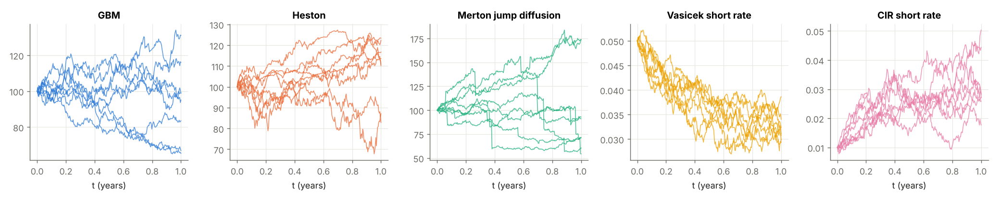
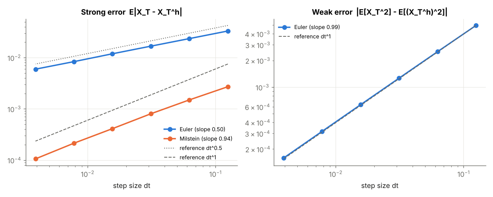
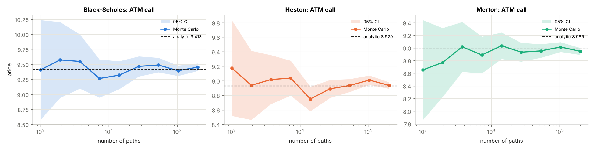
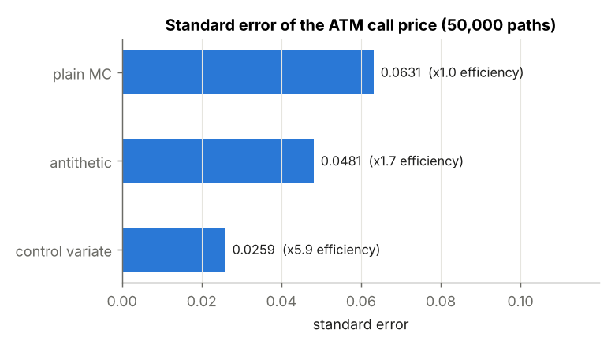
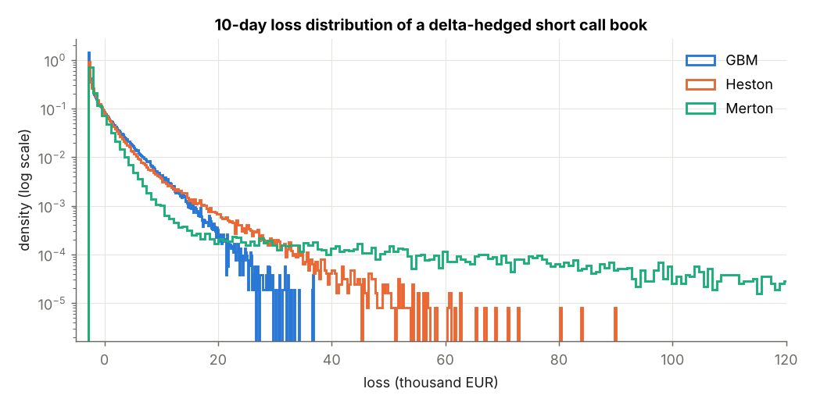
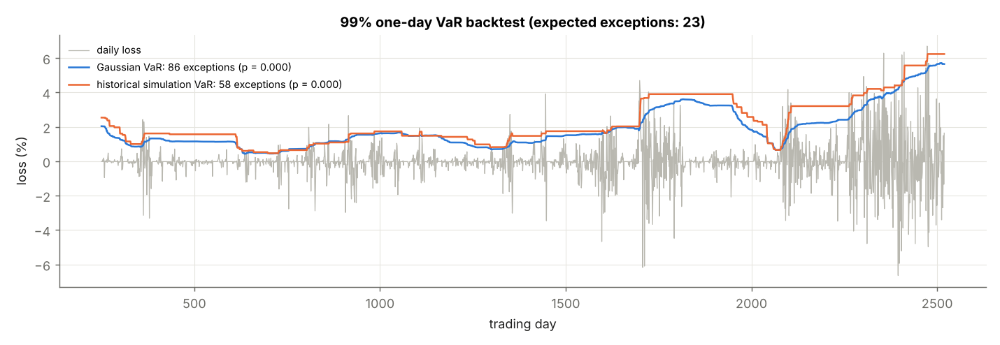

# Monte Carlo Simulation of Stochastic Differential Equations for Pricing and Risk Measurement of Financial Derivatives


Software project  M.Sc. Mathematics, University of Augsburg
Author: **Noreddine Razzouk**

---

## Overview

`mcsde` is a tested Python library that

1. **simulates stochastic processes** used in finance (GBM, Vasicek, CIR, Heston, Merton jump diffusion),
2. **validates the numerical schemes** (Euler-Maruyama, Milstein) by measuring their strong and weak convergence orders,
3. **prices derivatives by Monte Carlo** and checks every estimator against closed-form or semi-analytical benchmarks (Black-Scholes, Heston Fourier formula, Merton series),
4. **measures risk** (Value-at-Risk, Expected Shortfall) of an option portfolio by full revaluation and **backtests** VaR models with the Kupiec test.

The guiding principle is *validation*: every numerical result is compared with a known exact value, and these comparisons run automatically as unit tests on every push.



## Mathematical background

### Stochastic differential equations

We consider one-dimensional Itô SDEs

$$dX_t = \mu(t, X_t)\,dt + \sigma(t, X_t)\,dW_t, \qquad X_0 = x_0 .$$

| Model | Dynamics | Use |
|---|---|---|
| Geometric Brownian motion | $dS = \mu S\,dt + \sigma S\,dW$ | Black-Scholes equity model |
| Ornstein-Uhlenbeck / Vasicek | $dr = \kappa(\theta - r)\,dt + \sigma\,dW$ | short rate, mean reversion |
| Cox-Ingersoll-Ross | $dr = \kappa(\theta - r)\,dt + \sigma\sqrt{r}\,dW$ | non-negative short rate |
| Heston | $dS = \mu S\,dt + \sqrt{v}S\,dW^1,\; dv = \kappa(\theta - v)\,dt + \xi\sqrt{v}\,dW^2$ | stochastic volatility, skew |
| Merton | $dS/S_- = (\mu - \lambda k)\,dt + \sigma\,dW + (J-1)\,dN$ | jumps, fat tails |

### Discretisation schemes

With step size $h$ and Brownian increments $\Delta W_n \sim \mathcal N(0, h)$:

- **Euler-Maruyama:** $X_{n+1} = X_n + \mu(X_n)\,h + \sigma(X_n)\,\Delta W_n$
- **Milstein:** $X_{n+1} = X_n + \mu(X_n)\,h + \sigma(X_n)\,\Delta W_n + \tfrac12\sigma(X_n)\sigma'(X_n)\big(\Delta W_n^2 - h\big)$

A scheme has **strong order** $\gamma$ if $\mathbb E|X_T - X_T^h| \le C h^\gamma$ and **weak order** $\beta$ if $|\mathbb E f(X_T) - \mathbb E f(X_T^h)| \le C h^\beta$.
Theory: Euler has strong order 1/2 and weak order 1; Milstein has strong order 1.

### Monte Carlo pricing

Under the risk-neutral measure $\mathbb Q$ the price of a payoff $H$ is $V_0 = e^{-rT}\,\mathbb E^{\mathbb Q}[H]$, estimated by the sample mean over $N$ simulated paths with standard error $\hat\sigma/\sqrt N$. Variance is reduced with **antithetic variates** and a **control variate** ($e^{-rT}S_T$, whose mean $S_0$ is known). Sensitivities (Greeks) are estimated with the **pathwise**, **likelihood ratio** and **finite difference** (common random numbers) methods.

### Risk measures

For a loss $L$ and confidence level $\alpha$:

$$\mathrm{VaR}_\alpha(L) = \inf\{\ell : \mathbb P(L \le \ell) \ge \alpha\}, \qquad \mathrm{ES}_\alpha(L) = \mathbb E[L \mid L \ge \mathrm{VaR}_\alpha(L)] .$$

VaR models are backtested with the **Kupiec proportion-of-failures test**, a likelihood ratio test of $H_0$: exception probability $= 1-\alpha$.

## Results

All numbers are reproduced by `python scripts/run_experiments.py` (see [docs/results.md](docs/results.md)).

### 1. Convergence of the schemes

| quantity | empirical | theory |
|---|---|---|
| strong order Euler | 0.50 | 0.5 |
| strong order Milstein | 0.94 | 1.0 |
| weak order Euler | 0.99 | 1.0 |



### 2. Monte Carlo prices against analytical benchmarks

At-the-money call, $S_0 = K = 100$, $T = 1$, $r = 3\%$. All Monte Carlo estimates lie within their 95% confidence interval of the reference value.

| model | analytic | Monte Carlo | std. error |
|---|---|---|---|
| Black-Scholes | 9.4134 | 9.4533 | 0.0316 |
| Heston (Fourier) | 8.9294 | 8.9368 | 0.0233 |
| Merton (series) | 8.9862 | 8.9457 | 0.0281 |



### 3. Variance reduction

The control variate reduces the standard error by a factor of about 2.4, which corresponds to roughly 6 times fewer paths for the same accuracy.



### 4. Model risk in portfolio risk measurement

A short position in 10,000 at-the-money calls is delta-hedged with the underlying. Its 10-day losses are computed by **full revaluation** under three models calibrated to the same overall variance.

| model | VaR 99% | ES 99% |
|---|---|---|
| GBM | 11,626 EUR | 15,281 EUR |
| Heston | 14,997 EUR | 22,381 EUR |
| Merton | 17,288 EUR | 57,696 EUR |
| delta-normal approximation | 0 EUR | - |

**Findings:**
- The **delta-normal** method reports zero risk because the portfolio has zero delta. It completely misses the gamma risk, which full revaluation captures.
- **Jumps** (Merton) barely change VaR but almost quadruple Expected Shortfall compared to GBM. This shows why regulators (Basel FRTB) moved from VaR to ES.



### 5. VaR backtesting

Daily returns are simulated from a Heston model, which produces volatility clustering. Rolling 250-day 99% VaR forecasts are backtested over about 2,270 days.

| method | exceptions | expected | Kupiec p-value | rejected at 5% |
|---|---|---|---|---|
| Gaussian VaR | 86 | 22.7 | 0.000 | yes |
| historical simulation | 58 | 22.7 | 0.000 | yes |

Both static methods react too slowly to volatility clusters. The Gaussian model additionally underestimates the tails. This motivates conditional models such as GARCH or filtered historical simulation (see outlook).



## Validation

The test suite (`tests/`, 25 tests) checks the implementation against known results:

| area | what is tested |
|---|---|
| processes | exact mean and variance of GBM, OU, CIR; martingale property in Heston and Merton |
| convergence | strong order of Euler (0.5) and Milstein (1), weak order of Euler (1) |
| analytic | put-call parity, Greeks vs finite differences, Heston and Merton reduce to Black-Scholes |
| pricing | Monte Carlo vs Black-Scholes, Heston and Merton benchmarks; variance reduction; three delta estimators |
| risk | VaR/ES of the normal distribution, full revaluation vs delta-normal, Kupiec test |

Tests run automatically with GitHub Actions on Python 3.10 and 3.12.

## Project structure

```
mc-sde-finance/
├── src/mcsde/
│   ├── processes.py     # GBM, Vasicek, CIR, Heston, Merton
│   ├── schemes.py       # Euler-Maruyama, Milstein, antithetic increments
│   ├── convergence.py   # strong and weak convergence analysis
│   ├── analytic.py      # Black-Scholes + Greeks, Heston Fourier, Merton series
│   ├── pricing.py       # Monte Carlo pricing, variance reduction, Greeks
│   └── risk.py          # VaR, ES, portfolio revaluation, Kupiec backtest
├── tests/               # 25 validation tests (pytest)
├── scripts/run_experiments.py   # reproduces all figures and tables
├── docs/                # figures, results, project plan
└── .github/workflows/   # continuous integration
```

## Installation and usage

```bash
git clone https://github.com/Razzouknoreddine/mc-sde-finance.git
cd mc-sde-finance
python -m venv .venv && source .venv/bin/activate
pip install -e ".[dev]"

pytest -v                           # run the test suite
python scripts/run_experiments.py   # reproduce all results
```

Example:

```python
from mcsde import Heston, heston_price, mc_price, payoff_european

model = Heston(s0=100, mu=0.03, v0=0.04, kappa=2.0, theta=0.04, xi=0.5, rho=-0.7)
S, v = model.simulate(T=1.0, n_steps=200, n_paths=100_000)

print(mc_price(S, payoff_european(S, K=100), r=0.03, T=1.0))
print(heston_price(100, 100, 1.0, 0.03, v0=0.04, kappa=2.0, theta=0.04, xi=0.5, rho=-0.7))
```

## Outlook

- Calibration of the Heston model to market option prices
- Multilevel Monte Carlo (Giles, 2008) to reduce computational cost
- GARCH and filtered historical simulation for conditional VaR
- Quasi-Monte Carlo with Sobol sequences
- Performance-critical simulation kernel in C

## References

- P. Glasserman, *Monte Carlo Methods in Financial Engineering*, Springer, 2003
- P. E. Kloeden, E. Platen, *Numerical Solution of Stochastic Differential Equations*, Springer, 1992
- S. E. Shreve, *Stochastic Calculus for Finance II: Continuous-Time Models*, Springer, 2004
- A. J. McNeil, R. Frey, P. Embrechts, *Quantitative Risk Management*, Princeton University Press, 2015
- S. L. Heston, A closed-form solution for options with stochastic volatility, *Review of Financial Studies*, 1993
- R. C. Merton, Option pricing when underlying stock returns are discontinuous, *Journal of Financial Economics*, 1976
- P. H. Kupiec, Techniques for verifying the accuracy of risk measurement models, *Journal of Derivatives*, 1995
- H. Albrecher et al., The little Heston trap, *Wilmott Magazine*, 2007

## License

MIT
